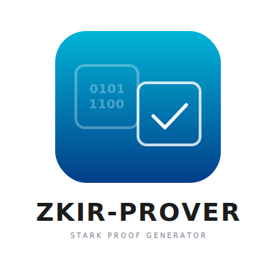

<p align="center">
  
</p>

STARK prover for [ZK IR](https://github.com/seceq/zkir) using Plonky3 with Baby Bear field.

## Overview

ZK IR Prover generates STARK proofs from execution traces of ZK IR programs. It uses a multi-chip architecture optimized for the 32-bit ZK IR instruction set.

### Key Features

- **32-bit only** - No field registers, all operations on 32-bit integers
- **Baby Bear field** - 31-bit prime (p = 2^31 - 2^27 + 1)
- **Syscall-based crypto** - Dedicated chips for Poseidon2, SHA256
- **~32 trace columns** - Minimal CPU chip design

### Architecture

```
┌─────────────────────────────────────────────────────────────────────────┐
│                              ZK IR Prover                               │
├─────────────────────────────────────────────────────────────────────────┤
│   ExecutionTrace          Multi-Chip Machine               Proof        │
│  ┌──────────────┐       ┌─────────────────────┐       ┌──────────────┐  │
│  │ Steps        │       │  ┌───────────────┐  │       │ STARK Proof  │  │
│  │ Syscalls     │──────►│  │   CPU Chip    │  │──────►│              │  │
│  │ Memory Log   │       │  │  (32 columns) │  │       │ ~50-100 KB   │  │
│  │ I/O          │       │  └───────────────┘  │       │              │  │
│  └──────────────┘       │  ┌───────────────┐  │       │ Verify: ~10ms│  │
│                         │  │ Memory Chip   │  │       └──────────────┘  │
│                         │  └───────────────┘  │                         │
│                         │  ┌───────────────┐  │                         │
│                         │  │ Syscall Chips │  │                         │
│                         │  │ (Poseidon,etc)│  │                         │
│                         │  └───────────────┘  │                         │
│                         └─────────────────────┘                         │
└─────────────────────────────────────────────────────────────────────────┘
```

## Installation

```bash
git clone https://github.com/seceq/zkir-prover
cd zkir-prover
cargo build --release
```

## Usage

### Generate a proof

```bash
zkir-prover prove --trace execution.zktrace -o proof.zkproof
```

### Verify a proof

```bash
zkir-prover verify proof.zkproof
```

### Show proof info

```bash
zkir-prover info proof.zkproof
```

### Security levels

- `--security fast` - ~80 bits, for testing
- `--security default` - ~100 bits
- `--security high` - ~128 bits

## Performance Estimates

| Trace Size | Prove Time | Verify Time | Proof Size |
|------------|------------|-------------|------------|
| 2^16 (64K) | ~0.3s      | ~10ms       | ~50KB      |
| 2^20 (1M)  | ~5s        | ~15ms       | ~80KB      |
| 2^24 (16M) | ~1.5min    | ~20ms       | ~120KB     |

## Related Projects

- [zkir](https://github.com/seceq/zkir) - ZK IR specification
- [zkir-llvm](https://github.com/seceq/zkir-llvm) - LLVM to ZK IR compiler
- [Plonky3](https://github.com/Plonky3/Plonky3) - STARK proving system

## License

Licensed under either of:

- Apache License, Version 2.0 ([LICENSE-APACHE](LICENSE-APACHE) or http://www.apache.org/licenses/LICENSE-2.0)
- MIT license ([LICENSE-MIT](LICENSE-MIT) or http://opensource.org/licenses/MIT)

at your option.
